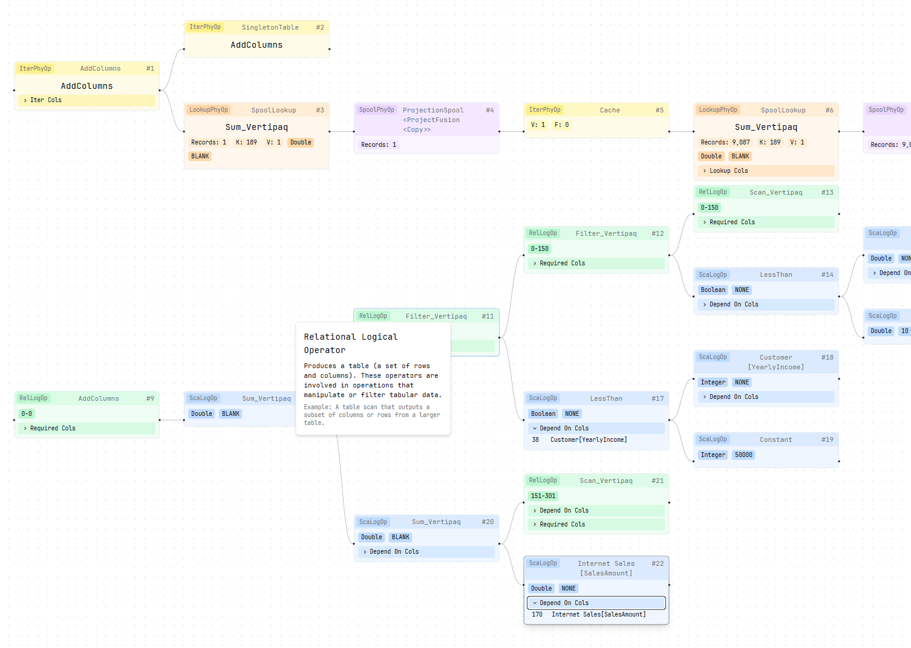

# DAX Query Explorer

The most powerful and intuitive way to visualize and analyze DAX query execution plans. DAX Query Explorer transforms complex query plans into interactive, visual flowcharts that make understanding query execution simple and efficient.

## Features

- **Interactive Visualization**: Transform text-based DAX query plans into interactive, visual flowcharts
- **Flexible Input Formats**: Support for both plain text query plans and JSON format exported from DAX Studio
- **Node Type Differentiation**: Distinct visual representations for different operation types:
  - Spool Physical Operations (SpoolPhyOp)
  - Iteration Physical Operations (IterPhyOp)
  - Lookup Physical Operations (LookupPhyOp)
  - Scalar Logical Operations (ScaLogOp)
  - Relational Logical Operations (RelLogOp)
- **Collapsible Nodes**: Simplify complex plans by collapsing nodes to focus on specific parts of the execution
- **Smart Layout**: Automatic node positioning and edge routing for optimal readability
- **Plan Sharing**: Share query plans with colleagues via unique URLs
- **Responsive Design**: Works seamlessly on both desktop and mobile devices

## Getting Started

1. Visit [DAX Query Explorer](https://dax-query-explorer.vercel.app)
2. Paste your DAX query plan into the editor:
   - Either paste the plain text query plan
   - Or paste the JSON output exported from DAX Studio
3. Click "Parse Query Plan" to generate the visual representation
4. Explore the execution plan through the interactive visualization

## Usage

### Viewing Query Plans

The interface is split into two main sections:
- Left: Code editor for inputting DAX query plans (accepts both text and JSON formats)
- Right: Interactive flowchart visualization

### Input Formats

DAX Query Explorer supports two input formats:
1. **Plain Text**: The standard text output of a DAX query plan
2. **JSON Format**: The JSON export from DAX Studio, containing both physical and logical query plan rows

### Node Information

Each node in the visualization contains important information about the operation:
- Operation type and name
- Number of records processed
- Key columns and value columns
- Additional operation-specific details

### Sharing Plans

1. Click the "Share Plan" button in the top right corner
2. A unique URL will be generated and copied to your clipboard
3. Share the URL with others to let them view the same query plan

## Why DAX Query Explorer?

Understanding DAX query plans is crucial for optimizing Power BI and Analysis Services performance. DAX Query Explorer makes this process intuitive by:

- Converting complex text-based plans into clear visual representations
- Highlighting relationships between operations
- Making it easy to identify bottlenecks and optimization opportunities
- Facilitating collaboration through plan sharing

## Contributing

We welcome contributions! Please feel free to submit issues and pull requests.

